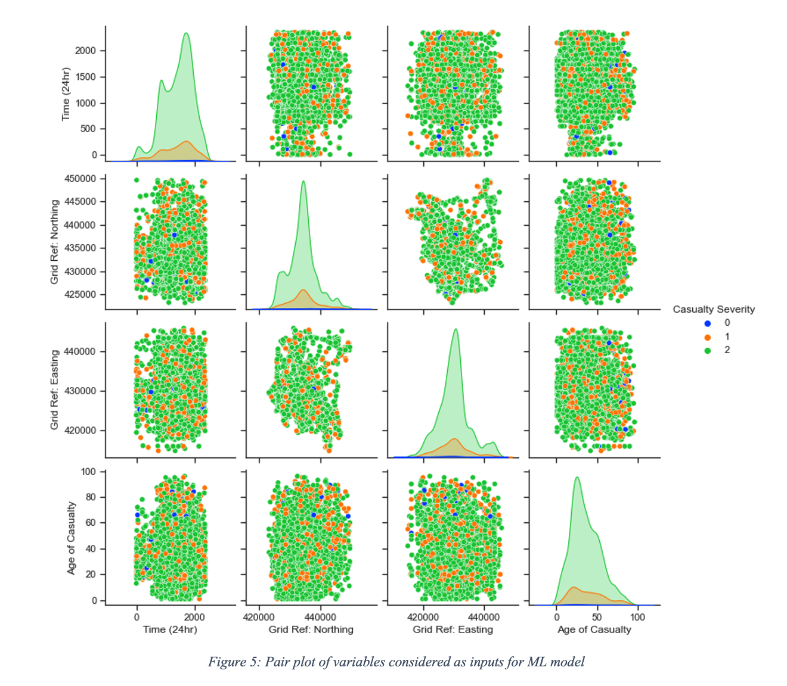

# _A Case Study Report on a Five-Year Analysis of Fatal Road Collisions in Europe and the UK and the impact of ITS Safety Applications_

_By James O&#39;Connor_

_Connected Vehicles - ENG09027_

# Introduction

The first ever recorded road fatality occurred in Ireland in 1869 [1]. Since that time, transportation systems have gone through multiple series of incremental and radical innovation. Vehicles have become faster, cheaper and more in-demand from an ever-increasing growth in global population. Infrastructure such as motorways and urban transportation networks have adapted in line with the growth in population. With this growth in our global population, and thus road users, one could assume a linear relationship to fatalities due to road collisions. However, this relationship is not so straight-forward. This is due in part to safety development of safety standards and applications in congruence with the advancement of transportation technology and increased road users. For example, in the UK the population grew by 15% in a 30 year period from 1985 to 2015 and despite this growth, road fatalities dropped by 68% [1]. While these numbers are improving, there is still much room for improvement. Approximately 1.35 million people are killed on the road each year [2]. Vehicle-to-Everything (V2X) is the collective term for communication mechanisms between vehicle, pedestrians, infrastructure and networks. A recent report suggests that V2X technology has the potential to reduce or eliminate 80% of traffic incidents of any type [3]. In this report, road traffic collisions over the past five years will be examined alongside the advancements in safety and standards in the same time frame. To gain a deeper understanding of how a shared communication channel such as V2X could be used to improve road safety a hypothesis was developed and tested using a machine learning model on an open source dataset.

# Data Analysis

## Overview of Fatal Road Collisions over the past five years

The European Transport Safety Council (ETSC) have reported a 3% decrease in road deaths between 2018 and 2019 across the 27 member states. At the same time, the number of road deaths have collectively reduced by only 6% over the last five years, in contrast to the EU target of 17% for the same period. In fact, the target reduction versus the actual reduction in fatalities has been diverging since 2013 [4] . Child road safety has drastically reduced, older people are more active and are living longer increasing the fatality rate in this cohort and the 17-24 year old group are statistically over-represented [1].

Interestingly, due to the COVID pandemic and subsequent travel and movement restrictions, there has been an unprecedented reduction in road fatalities. April 2021 figures showed a 36% reduction in comparison to the same month over the past three years [5].

While this reduction is welcomed, it does not hide the fact that reductions in fatalities in general have been plateauing across the bloc over the past five years. A report by PwC [6]highlights that road traffic injuries are the ninth leading cause of death worthwhile, and for the age group 15-29, road traffic injuries are the leading cause of death.

The report also discuss a framework to reduce road fatalities which is based on four key ideas:

1. Reliable Data Collection - Investigators should be trained so that they can correctly investigate and collect reliable data.
2. Better Engineering – Investment in smart, well-planned infrastructure along with funding in vehicle technology.
3. Education – More emphasis on school education, driver training and road safety campaigns.
4. Road Safety Law Enforcement - Effective law enforcement through repressive measures such as fixed speed cameras along with preventative effects such as increase in police presence, both of which have been proven to reduce road fatalities.

Only through application do frameworks such as the one presented above become useful. The EU has adopted a strategy called &quot;Vision Zero&quot; (based on the successful implementation in Sweden), one which aims to reduce road deaths to near zero by 2050 [7] in large part through legislative change. The following section will examine the EU work and legislation that has been passed over the past number of years on road safety and fatalities.

## EU Safety Advancements and Standards Implemented Since 2016

There has been a number of regulatory changes made in road safety standard over the past number of years to promote road safety. Regulation 2019/2144 [8]was introduced in 2019 making a number of key features mandatory by 2022. These features include warning of drowsiness and distraction, intelligent speed assistance, black box recording, lane-keeping assistance, advanced emergency braking and more. A new emergency service called eCall, which is an automatic emergency response system is required in all car and van models from March 2018. This new system hopes to shorten time for emergency services to arrive. Reducing emergency services has been shown to reduce deaths on the road [9]. Directive 2019/1936, an amendment to existing road infrastructure safety management [10], aims to address a number of issues. Some of these include creating high quality road markings, improved safety at level crossings, protection for vulnerable road users and targeted investment in road sections with high accident concentration.

There is also a number of funding instruments available. In April of 2021 the European Climate, Infrastructure and Environment Executive Agency (CINEA) was founded as part of the Connecting Europe Facility (CEF) for Transport, which funds major transport infrastructure policy. However, it seems that the use of these funding instruments has been low due to the complexities of the funding environment, and the EU have vowed to make this funding more accessible in future instruments [11].

From 2011 to 2020, the Policy Orientations on Road Safety formed the framework for road safety action at an EU level. The strategic goal was to reduce road fatalities by 50% by 2020. Interim analyses in 2015 and 2018 showed that safer vehicles and better post-crash care had reduced the fatality numbers, but increased the serious injury statistics [11]. A Safe System was developed based on this and other results from the interim analyses, which formed the basis of the &quot;EU Road Safety Policy Framework 2021-2030&quot;. The core focus of this framework is on the prevention of death and serious injury . Other areas such as retrofitting existing fleets with ADAS systems, an EU driving licence, mandatory driver distractedness technology, shared modes of transportation are also being explored [11].

## Using V2X to Improve Safety

It has been estimated that road surroundings and road infrastructure are a contributor to 30% of road traffic accidents [12]. Connected vehicles and ITS offer an unprecedented opportunity in safety enhancements, which were not possible using the model of unconnected vehicles. There have been multiple novel studies in this area over the past few years that reiterate this.

[13] propose using Wireless Body Area Networks (WBAN), a communication mechanism between pedestrian and vehicles, and showed that this approach can significantly increase safety for all road users, including drivers, passengers and pedestrians. [14] looked at using V2X communication at an intersection to pass safety-critical messages to vehicles based on observations from sensors. V2X communication has been proven to use dynamic real-time information exchange to manage traffic lights at intersections. A natural extension of this could be to use the real-time data from multiple vehicles and both local and global sensors to create a machine learning model that can predict likelihoods of road traffic collisions. This model could be used to predict scenarios that have previously resulted in serious or fatal road accidents, and update or even adjust vehicle parameters accordingly. To further test this idea based on the literature researched, a hypothesis was developed as follows:

**An ML model can to predict the potential severity of a road collision given real-time driver/ vehicle data in \&gt; 95% of cases.**

Should this hypothesis be proven, there are a number of areas it could be applied including proactive warnings, dynamic speed limit adjustment and redistribution of emergency service vehicles. The following section will look at testing this hypothesis using a publicly available dataset.

## Hypothesis Testing - ML Model used by V2X to Predict Road Traffic Warnings

To expand on this idea an analysis was undertaken on a dataset of road traffic incidents in Leeds, United Kingdom, spanning four years from 2016 to 2019. The dataset was published by Leeds City County and includes a set of 7576 traffic incidents. Table 1 shows the categories under which each accident had been labelled, as well as the method of labelling the data. The categories road surface and casualty severity are used as an example to demonstrate the

labelling method. A full list of the labels are available in Appendix 1.

The geographical grid location (Easting and Northing), the accident date and accident time were also captured for each accident. The data had to be encoded with the relevant numerical labels for some of the categories.

To model any linear relationship, inputs and outputs are required. As the end goal was to create a linear model that could predict the potential severity of a road collision were one to occur at a given time, the category &quot;Casualty Severity&quot; was chosen as our y-value output, the value we want to predict. Each accident was classified as either a slight, serious or fatal in severity. All other categories listed in Table 1 Category column were taken as inputs.

The data was validated, cleansed and normalised. Table 2 shows a sample output of this data pre-processing and Table 3 shows the same data post normalization. Data was normalised to reduce the magnitude of some features such as the Easting and Northing measurements.

### Dimensionality Reduction

Dimensionality reduction refers to the process of reducing the number of dimensions of features in the dataset [15]. This has a number of benefits including reducing computational overhead, noise and multi-collinearity [16]. To start with, a decision tree regressor was used to find the relative influence of each input on the outcome, the casualty severity. A decision tree regressor is a predictive model expressed as a recursive partition of the feature space to subspaces that constitute a basis for prediction [17]. Using this method, the predictive influence of the 11 input categories on the output could be calculated relatively. Figure 3 describes this relationship in detail. This showed that the categories Grid Ref Northing, Time, Grid Ref Easting an Age of Casualty were the four most influential predictors of Casualty severity. Factors such as road surface, weather conditions, sex of casualty and casualty class all had a relatively lower impact in predicting casualty severity.

Using this result, the number of input variables were reduced to the four most influential predictors. A pair plot was used to explore relationships between them (see Figure 5). For reference, blue indicates a fatality (0 class), orange indicates a serious injury (1 class) and green indicates a slight injury (2 class).

The pair plot showed some interesting results. Two things became apparent from the dataset, age and time of day were two key feature in predicting road traffic fatalities. For age, the blue dots (fatality = 0) are most prevalent in the 60 and over age group. Interestingly, this contradicts the results from [1]with the 17-24 year old group being statistically over-represented. For time-of-day, there is a grouping of blue dots in the 12am to 5am time period indicating the most severe road traffic incidents occur at night.

## Model Evaluation

A Support Vector Machine (SVM) was used to train the model. The data was split into a 75/25 split between training/test data. Training time was under 1 second. Once the model was trained and gave an 80.5% accuracy in predicting the severity of a road traffic collision based on the four inputs of northing, easting, time of day and age of casualty. While this is a relatively high accuracy score, the hypothesis has not being proven and the null hypothesis stands.

# Discussion

V2X provides a new frontier for vehicle safety. The model created in this study shows how we can use simple data such as GPS location, time of day and age of drivers to accurately predict the outcome of a collision. Although the hypothesis was not proven, with additional data and training, a higher accuracy could most likely be achieved. Interestingly, some of the data features such as road surface, weather conditions and type of vehicle may seem obvious in determining the severity of road traffic accidents e.g., a truck driving on a wet road while it is raining. However, these variables were actually poor predictors of the outcome in this dataset. The results seem to suggest that accident &quot;hot-spots&quot; are occurring (due to the Easting and Northing measurements) at certain times of the day. This could be linked to speed limits in certain areas as probability of a fatal collision increases with higher speeds. Also, the survival rate was lower in the 60+ age group. These results indicate key predictors that can be used to estimate the severity of a collision, however the sample size is regional to a town in the UK. Considering in the interim analysis of the last EU directive highlighted that results are very much dependent on action at a Member State level [11], wider datasets need to be made available and analysed to fully understand the wider predictors of these collisions on an EU level.

Having an accurate prediction model and high quality data is only part of the overall solution. High speed wireless technologies like 5G are a critical enabling component in wireless communication technologies, particularly within the context of delivering safety messages. A recent study by [18] showed promising results in the safety-related communications over IEEE 802.11p.

# Recommendations

In order to overcome the plateauing numbers that we are seeing across Europe, the approach to vehicle and road safety needs to be designed through the lens of new technologies that were not available in previous years. The technology landscape is vastly different today when compared to when the EU safety directive for the last decade was designed. As long as there is a human behind the wheel acting as the controller, there are certain biological limitations of human reaction time that cannot be overcome. Using connected and autonomous vehicles, as well as smarter ADAS functions such as lane keeping and departure warnings and adaptive speed control – more control is offloaded to the vehicle. Through this the limitations of control are no longer bound by reaction time but by the technical limitations of the system.

**Recommendations**

- Collision data must be collected and made accessible in a standardised format on an EU wide level in order to develop models such as the one presented in this paper.
- V2X technologies have been shown to be effective in increasing road safety and should be included in the formation of policy going forward.
- Buy-in from all Member States across the EU should be prioritised.
- Data analysis suggested that the 60+ age group are the most vulnerable road users therefore the safety of this cohort should be prioritised.
- Data analysis also indicated that location is a key predictor for fatal road traffic collisions. Therefore an EU-wide analysis should be taken to identify the common denominators of these locations and use this data to drive policy decisions.

# Conclusion

In this report, the policies and frameworks for road safety within the EU have been discussed. It is clear that the approach in the EU over the last decade worked to a point, but has been failing to reduce the level of road fatality across the bloc over the last number of years. There are technology opportunities that exist today, such as V2X and machine learning that were not as readily available during the formation of road safety policy for the past decade. A simple machine learning model developed to be able to predict the severity of a road traffic collision using open source data demonstrates this. Intelligent transport systems alone may not be the silver bullet in reducing road fatalities across the EU, there are many other factors at play, however they present us with unprecedented opportunities to redefine road safety.

# Bibliography

 
[1]  The Atlantic, &quot;The First Fatal Car Crash,&quot; August 2019. [Online]. Available: https://www.theatlantic.com/science/archive/2019/08/pioneering-female-scientist-was-first-car-crash-victim/597037/. [Accessed April 2021]. 

 [2]  Department For Transport, &quot;Factors affecting reported road casualties,&quot; 2015. [Online]. Available: https://assets.publishing.service.gov.uk/government/uploads/system/uploads/attachment\_data/file/556406/rrcgb2015-02.pdf. [Accessed 10 April 2021]. 

 [3]  World Health Organisation, &quot;Global status report on road safety 2018,&quot; 2018. [Online]. Available: https://www.who.int/publications/i/item/9789241565684. [Accessed 20 April 2021]. 

 [4]  NHTSA, &quot;https://www.nhtsa.gov/technology-innovation/automated-vehicles-safety,&quot; 2019. [Online]. Available: https://www.nhtsa.gov/technology-innovation/automated-vehicles-safety. [Accessed 20 April 2021]. 

 [5]  European Transport Safety Council, &quot;Road deaths in the European Union – latest data,&quot; 2020. [Online]. Available: https://etsc.eu/euroadsafetydata/. [Accessed 21 April 2021]. 

 [6]  European Transport Safety Council, &quot;The Impact of Covid-19 Lockdowns on Road Deaths in April 2020,&quot; July 2020. [Online]. Available: https://etsc.eu/pin-briefing-the-impact-of-covid-19-lockdowns-on-road-deaths-in-april-2020/. [Accessed 22 April 2021]. 

 [7]  PWC, &quot;A Guide for Policy Makers: on Reducing Road Fatalities,&quot; PWC, 2017. 

 [8]  European Commission, &quot;Mobility and Transport,&quot; 2020. [Online]. Available: https://ec.europa.eu/transport/road\_safety/what-we-do\_en. [Accessed 20 April 2021]. 

 [9]  European Commision, &quot;Safety in the automotive sector,&quot; 2019. [Online]. Available: https://ec.europa.eu/growth/sectors/automotive/safety\_en. [Accessed 24 Aprill 2021]. 

 [10]  N. S. S. W. a. J. M. S. Djahel, &quot;Reducing emergency services response time in smart cities: An advanced adaptive and fuzzy approach,&quot; _IEEE First International Smart Cities Conference (,_ pp. 1-8, 2015. 

 [11]  Eurpoean Commission, &quot;Directive (EU) 2019/1936 of the European Parliament,&quot; 2019. [Online]. Available: https://eur-lex.europa.eu/legal-content/EN/TXT/?uri=celex%3A32019L1936. [Accessed April 2021]. 

 [12]  Eurpoean Commission, &quot;EU Road Safety Policy Framework 2021-2030 - Next steps towards &quot;Vision Zero&quot;,&quot; Brussels, 2019. 

 [13]  DANISH ROAD TRAFFIC ACCIDENT INVESTIGATION BOARD (AIB), &quot;Why do road traffic accidents happen?,&quot; Danish Road Traffic Accident Investigation Board, 2015. 

 [14]  M. Gajewska, &quot;Novel proposal for V2X systems and WBAN cooperation to improve road safety,&quot; _15th International Conference on ITS Telecommunications (ITST),_ pp. 1-5, 2017. 

 [15]  S. L. H. M. L. J. A. J. a. H. S. O. J. Lee, &quot;Effectiveness Analysis of Warning Service using V2X Communication Technology at Intersection,&quot; _International Conference on Information and Communication Technology Convergence (ICTC),_ pp. 1506-1509, 2018. 

 [16]  Science Direct, &quot;Learning in Big Data: Introduction to Machine Learning,&quot; 2020. [Online]. Available: https://www.sciencedirect.com/topics/computer-science/dimensionality-reduction#:~:text=Dimensionality%20reduction%2C%20or%20variable%20reduction,astronomical%20catalogues%2C%20etc.).. [Accessed 2020]. 

 [17]  DeepAI, &quot;What is Feature Reduction,&quot; [Online]. Available: https://deepai.org/machine-learning-glossary-and-terms/feature-reduction#:~:text=Feature%20reduction%20leads%20to%20the,machine%20learning%20model%20in%20use.. 

 [18]  ScienceDirect, &quot;Decision Trrees,&quot; 2019. [Online]. Available: https://www.sciencedirect.com/topics/computer-science/decision-trees. [Accessed April 2021]. 

 [19]  C. A. G. a. M. C. M. Klapez, &quot;Application-Level Performance of IEEE 802.11p in Safety-Related V2X Field Trials,&quot; _IEEE Internet of Things Journal,,_ vol. 7, no. 5, pp. 3850-3860, 2020. 

# Appendix 1

| **Road Class** | **Road Class Desc** |
| --- | --- |
| **1** | Motorway |
| **2** | A(M) |
| **3** | A |
| **4** | B |
| **5** | C |
| **6** | Unclassified |
|
 |
 |
| **Road Surface** | **Road Surface Description** |
| **1** | Dry |
| **2** | Wet / Damp |
| **3** | Snow |
| **4** | Frost / Ice |
| **5** | Flood (surface water over 3cm deep) |
|
 |
 |
| **Lighting Conditions** | **Lighting Conditions Desc** |
| **1** | Daylight: street lights present |
| **2** | Daylight: no street lighting |
| **3** | Daylight: street lighting unknown |
| **4** | Darkness: street lights present and lit |
| **5** | Darkness: street lights present but unlit |
| **6** | Darkness: no street lighting |
| **7** | Darkness: street lighting unknown |
|
 |
 |
| **Weather Conditions** | **Weather Conditions Desc** |
| **1** | Fine without high winds |
| **2** | Raining without high winds |
| **3** | Snowing without high winds |
| **4** | Fine with high winds |
| **5** | Raining with high winds |
| **6** | Snowing with high winds |
| **7** | Fog or mist ñ if hazard |
| **8** | Other |
| **9** | Unknown |
|
 |
 |
| **Casualty Class** | **Casualty Class Desc** |
| **1** | Driver or rider |
| **2** | Vehicle or pillion passenger |
| **3** | Pedestrian |
|
 |
 |
| **Casualty Severity** | **Casualty Severity Desc** |
| **1** | Fatal |
| **2** | Serious |
| **3** | Slight |
|
 |
 |
| **Sex of Casualty** | **Sex of Casualty Desc** |
| **1** | Male |
| **2** | Female |
|
 |
 |
| **Age of Casualty** |
| [Age given in years] |
|
 |
 |
| **Type of Vehicle** | **Type of Vehicle Desc** |
| **1** | Pedal cycle |
| **2** | M/cycle 50cc and under |
| **3** | Motorcycle over 50cc and up to 125cc |
| **4** | Motorcycle over 125cc and up to 500cc |
| **5** | Motorcycle over 500cc |
| **6** | [Not used] |
| **7** | [Not used] |
| **8** | Taxi/Private hire car |
| **9** | Car |
| **10** | Minibus (8 ñ 16 passenger seats) |
| **11** | Bus or coach (17 or more passenger seats) |
| **12** | [Not used] |
| **13** | [Not used] |
| **14** | Other motor vehicle |
| **15** | Other non-motor vehicle |
| **16** | Ridden horse |
| **17** | Agricultural vehicle (includes diggers etc.) |
| **18** | Tram / Light rail |
| **19** | Goods vehicle 3.5 tonnes mgw and under |
| **20** | Goods vehicle over 3.5 tonnes and under 7.5 tonnes mgw |
| **21** | Goods vehicle 7.5 tonnes mgw and over |
| **22** | Mobility Scooter |
| **90** | Other Vehicle |
| **97** | Motorcycle - Unknown CC |